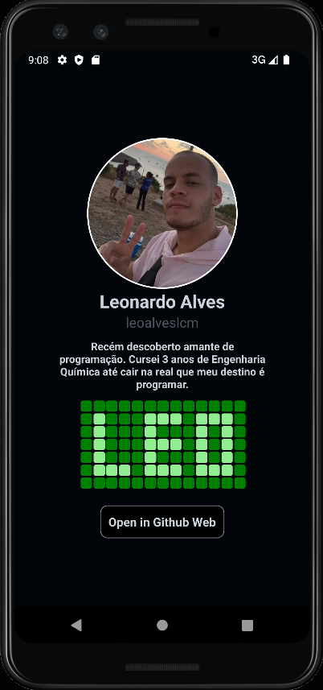

# DIO
# Introdução ao React Native 

# Conteúdo
- Conhecendo o React Native
  - O que é React Native 
  - O que é Cross-plataform
  - Origem do RN
- Documentação
  - Componentes 
  - APIs
  - Comunidade (Blog)
- Setup
  - Instalação do Chocolatey
  - NOde
  - Java 11 (JDK)
  - Yarn
  - Android Studio
    - Donwload android S
    - Criar um avd (Android Virtual Device)
- Criação do projeto
  - Uso do React Native CLI
  - Estrutura de pastas 
- Projeto Profile
  - View
  - Text
  - SafeAreaView
  - Image
  - Flex-Blox
  - Style (StylesSheet)
  - Pressable
  - Linking API
  - Add código nativo no AndroidManifest.xml para abrir link
